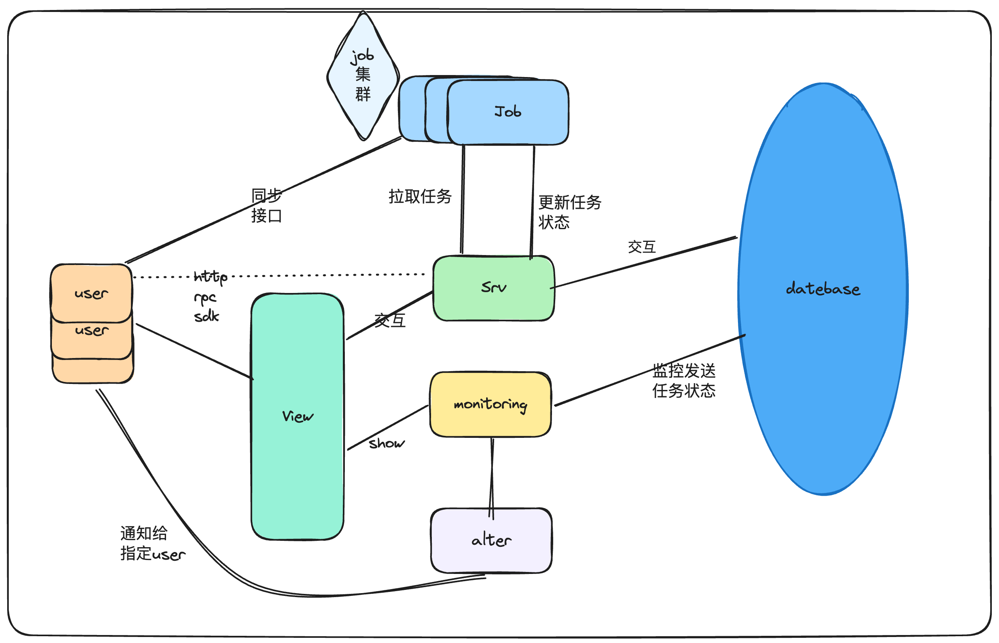

  

<h4 align="center">
<a href="README_CN.md">English Document</a> | <a href="README_CN.md">中文文档</a>
</h4>

## 🡠Introduction
GeeseLink is a lightweight message middleware based on sms4j.

### Features
- Has the function of synchronous and asynchronous sending SMS.
- Sms4j integrates all SMS vendors' SMS business.
- Email sending.
- OA sending (under development).
- Configurable message sending priority, retry count, timeout, etc.
- Message template management.
- Message sending monitoring.
- Distributed cluster consumption information (under development).
- Message alarm (under development).
- Message push (under development).
- Message log (under development).
- Message blacklist (under development).
- ...

## 🥐Modules

### 🍔 [geeselink-common](./geeselink-common)
- Public module
- Common utility classes
- Public configurations
- Public exceptions
- ...

### 🍟 [geeselink-job](./geeselink-job)
- Job scheduling module
- Scheduled tasks
- Asynchronous tasks
- ...

### 🍕 [geeselink-srv](./geeselink-srv)
- Service module
- SMS service
- Email service
- Template service
- ...

### 🍦 [geeselink-monitor](./geeselink-monitor)
- Monitoring module
- Message sending monitoring
- ...

### 🍨 [geeselink-ui](./geeselink-ui)
- Frontend module
- ...

## Architecture Diagram

## 🐕 Quick Start

- todo

### 🐈 1. Local Installation
todo

### 🐈 2. Docker Installation
todo

## ✨ Contributors
<table>
  <tbody>
    <tr>
      <td align="center" valign="top" width="14.28%"><a href="https://github.com/TJxiaobao"> <b>铁甲小宝</b></a> <a href="https://github.com/GeeseLink/issues?q=author%3ATJxiaobao" title="Design">🎨</a> <a href="https://github.com/GeeseLink/commits?author=TJxiaobao" title="Code">💻</a> <a href="https://github.com/GeeseLink/commits?author=TJxiaobao" title="Documentation">📖</a></td>
        <td align="center" valign="top" width="14.28%"><a href="https://github.com/ZY945"> <b>东风</b></a> <a href="https://github.com/apache/hertzbeat/commits?author=ZY945" title="Code">💻</a> <a href="#design-ZY945" title="Design">🎨</a> <a href="https://github.com/apache/hertzbeat/commits?author=ZY945" title="Documentation">📖</a></td>
    </tr>
    </tbody>
</table>

## Star History

## 🍔 Word
This project is currently in the development stage, and there may be many areas that are not very perfect. We hope everyone can be more tolerant. We also hope that everyone can support us more!
Open source is not easy, we hope everyone can support us more, thank you!
- If you think this project is good, welcome to give me a star.
- If you have better suggestions, welcome to raise an issue.
- If you want to participate in this project, welcome to submit a PR.