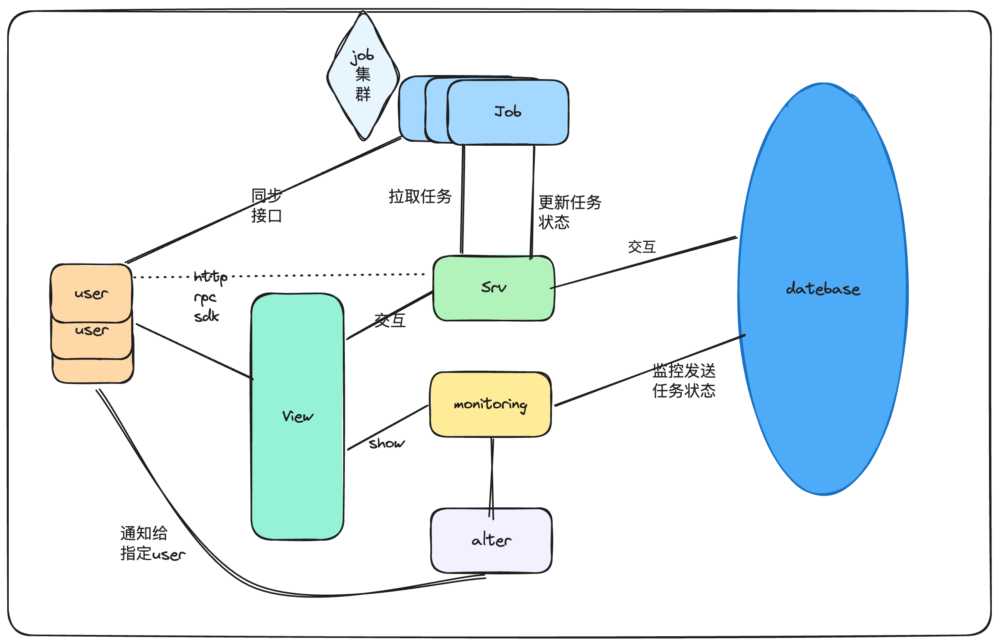

  

<h4 align="center">
<a href="README_CN.md">English Document</a> | <a href="README_CN.md">中文文档</a>
</h4>

## 🎡 介绍
GeeseLink 是一款基于sms4j的轻量级消息中台。

### 特点
- 具有同步和异步发送短信的功能。
- 具有Sms4j集成所有短信厂商的短信业务。
- 邮件发送。
- OA发送（开发中）。
- 可配置消息发送优先级、重试次数、超时时间等。
- 消息模板管理。
- 消息发送监控。
- 具有分布式集群消费信息（开发中）。
- 消息告警（开发中）。
- 消息推送（开发中）。
- 消息日志（开发中）。
- 消息黑名单（开发中）。
- ...

## 🥐 模块

### 🍔 [geeselink-common](./geeselink-common)
- 公共模块
- 通用工具类
- 公共配置
- 公共异常
- ...

### 🍟 [geeselink-job](./geeselink-job)
- 任务调度模块
- 定时任务
- 异步任务
- ...

### 🍕 [geeselink-srv](./geeselink-srv)
- 服务模块
- 短信服务
- 邮件服务
- 模版服务
- ...

### 🍦 [geeselink-monitor](./geeselink-monitor)
- 监控模块
- 消息发送监控
- ...

### 🍨 [geeselink-ui](./geeselink-ui)
- 前端模块
- ...

## 🍹 架构图

## 🐕 快速开始

- todo

### 🐈 1、本地安装
todo

### 🐈 2、Docker安装
todo

## ✨ Contributors

<table>
  <tbody>
    <tr>
      <td align="center" valign="top" width="14.28%"><a href="https://github.com/TJxiaobao"> <b>铁甲小宝</b></a> <a href="https://github.com/GeeseLink/issues?q=author%3ATJxiaobao" title="Design">🎨</a> <a href="https://github.com/GeeseLink/commits?author=TJxiaobao" title="Code">💻</a> <a href="https://github.com/GeeseLink/commits?author=TJxiaobao" title="Documentation">📖</a></td>
        <td align="center" valign="top" width="14.28%"><a href="https://github.com/ZY945"> <b>东风</b></a> <a href="https://github.com/apache/hertzbeat/commits?author=ZY945" title="Code">💻</a> <a href="#design-ZY945" title="Design">🎨</a> <a href="https://github.com/apache/hertzbeat/commits?author=ZY945" title="Documentation">📖</a></td>
    </tr>
    </tbody>
</table>

## Star History

## 🍔 有话说
本项目目前处于开发阶段，可能有很多地方并不是很完善，希望大家多多包含。也希望大家能够多多支持！
开源不易，希望大家多多支持，谢谢！
- 如果你觉得这个项目不错，欢迎给我一个star。
- 如果你有更好的建议，欢迎提出issue。
- 如果你想参与这个项目，欢迎提交pr。